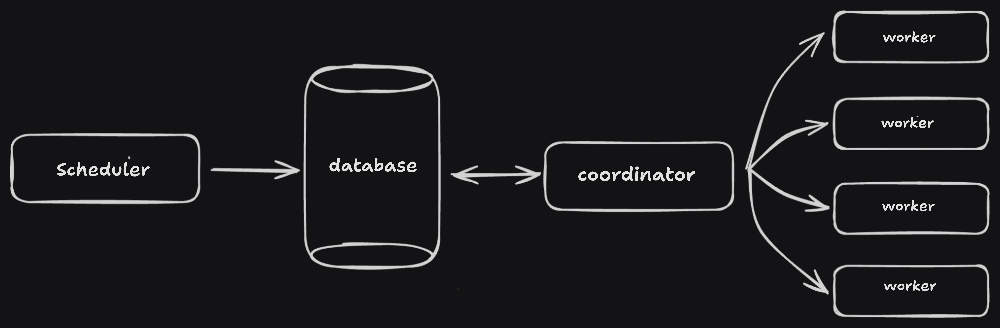

# Hydra

   

Hydra is a task scheduler designed for educational purposes, handling high task volumes across multiple workers. 
Written in Python and C++, it comprises:

- Scheduler: Receives tasks and schedules them for execution.
- Coordinator: Manages task selection, worker registration, and distribution of tasks for execution.
- Worker: Executes assigned tasks, reporting status back to the Coordinator.
- Database: PostgreSQL database stores task details, aiding task management.

Communication between components uses gRPC and http for scalability and fault tolerance.

